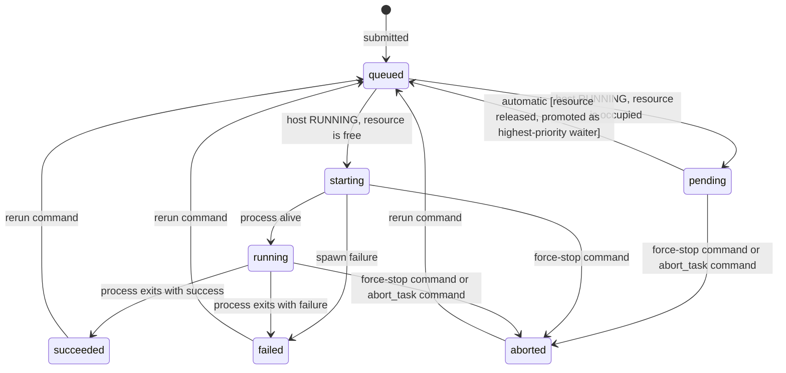
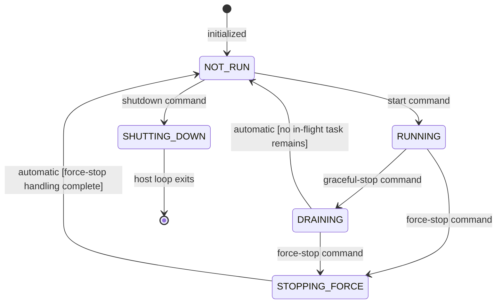

# TaskManager and State Machine Detailed Design

Back to architecture: [design_arch.md](design_arch.md)

Implementation file: [../core/task_manager.py](../core/task_manager.py)

## 1. Responsibility

TaskManager is the source of truth for task lifecycle and host runtime counters.

## 2. Task Lifecycle Model

Task states:

1. `queued`
2. `pending`
3. `starting`
4. `running`
5. `succeeded`
6. `failed`
7. `aborted`

State semantics:

1. `queued`: task is eligible for immediate scheduling consideration in the next tick.
2. `pending`: task has been evaluated by the scheduler but its required remote resource is currently held by another `starting` or `running` task; it waits for the resource to be released.
3. `starting`: task has been admitted and the resource lock is held; startup has begun (script materialization/spawn phase), but stable running execution has not been confirmed yet.
4. `running`: task process is alive and task output can be observed.
5. `succeeded`: task finished with success exit code in the latest attempt.
6. `failed`: task finished with non-zero exit code or spawn failure in the latest attempt.
7. `aborted`: task was interrupted by manual force-stop policy, per-task user abort, or force-stop from `pending` state.

Terminal states:

1. `succeeded`
2. `failed`

Note: `aborted` is not a terminal state; aborted tasks may be rerun. `pending` is not a terminal state; pending tasks are eligible for promotion to `queued` when their resource is released.

### 2.1 Transition Sources and Ownership

TaskManager is the only state-commit authority. It applies transitions from two sources under one validation rule set:

1. Automatic events:
	- scheduler admission and runner completion
	- admission condition: host must be in `RUNNING` state for `queued -> starting` to trigger
	- resource conflict: scheduler signals `to_pending`; TaskManager commits `queued -> pending`
	- resource release: when any task reaches a terminal state, TaskManager promotes the highest-priority pending task for that resource back to `queued`
	- example: `running -> succeeded|failed` based on process exit code
2. Manual events:
	- stop/abort commands coordinated by ControlPlane
	- example: `running -> aborted` when forced stop policy applies or when per-task user abort is requested
	- example: `pending -> aborted` when force_stop or per-task abort_task is issued against a pending task
3. Rerun events:
	- user rerun command coordinated by ControlPlane
	- example: `succeeded|failed|aborted -> queued`

Both sources must go through the same transition validator to keep lifecycle consistency.

### 2.2 Task Transition Policy

Baseline transitions:

1. `queued -> starting` (condition: host in `RUNNING` state, resource is free)
2. `queued -> pending` (condition: host in `RUNNING` state, resource is occupied)
3. `pending -> queued` (automatic: resource released, this task promoted as highest-priority waiter)
4. `pending -> aborted` (force-stop path or per-task abort_task path)
5. `starting -> running|failed`
6. `running -> succeeded|failed`
7. `running -> aborted` (force-stop path)
8. `succeeded|failed|aborted -> queued` (rerun path)
9. `starting -> aborted` (force-stop path)
10. `running -> aborted` (per-task user abort path)

### 2.3 Queue Ordering and Priority

1. Each task has a mandatory `priority: int` field (positive integer; lower value = higher priority).
2. Each task has a mandatory `resource: str` field (remote machine identifier, case-sensitive, must match a registered resource).
3. The internal queue is maintained in sorted order: ascending by `(priority, created_at)`.
4. Initial load and `append` submissions insert tasks at the correct position by (priority, created_at) — stable sort.
5. `rerun` appends tasks to the tail of the queue, sorted among themselves by (priority, created_at) — they do not jump ahead of waiting queued tasks.
6. `pending -> queued` promotions re-insert at the correct position by original `created_at` — the task retains its natural position relative to other tasks with the same priority.

### 2.4 Resource Lock Protocol

1. Resource lock is written when a task enters `starting` — not when it enters `running`. This ensures the Scheduler sees the lock in the same tick and prevents a second task from being admitted to the same resource.
2. Resource lock is released when a task enters any terminal state (`succeeded`, `failed`, `aborted`) or when force-stop clears the lock table.
3. After resource release, TaskManager selects the single highest-priority pending task for that resource and promotes it to `queued`. If multiple pending tasks share the minimum priority, one is chosen randomly.
4. Lock table: `resource_lock: dict[str, str]` mapping `resource_id -> task_id`.
5. Pending index: `pending_by_resource: dict[str, list[str]]` mapping `resource_id -> [task_id, ...]` sorted by (priority, created_at).

## 3. Host Lifecycle Model

Host states:

1. `NOT_RUN`
2. `RUNNING`
3. `DRAINING`
4. `STOPPING_FORCE`
5. `SHUTTING_DOWN`

Host state semantics:

1. `NOT_RUN`: host is initialized but not executing; waiting for start or shutdown command.
2. `RUNNING`: host is actively scheduling tasks; stays in this state even after all current tasks complete, allowing further rerun requests.
3. `DRAINING`: graceful-stop issued; no new tasks are admitted; waiting for in-flight tasks to finish.
4. `STOPPING_FORCE`: force-stop issued; in-flight tasks are being aborted.
5. `SHUTTING_DOWN`: process is terminating; entered only from `NOT_RUN`.

Host transition policy:

1. `NOT_RUN -> RUNNING` by explicit start command.
2. `RUNNING -> DRAINING` by graceful-stop command.
3. `RUNNING -> STOPPING_FORCE` by force-stop command.
4. `DRAINING -> STOPPING_FORCE` by force-stop command.
5. `DRAINING -> NOT_RUN` when no in-flight task remains.
6. `STOPPING_FORCE -> NOT_RUN` after force-stop handling is completed.
7. `NOT_RUN -> SHUTTING_DOWN` by shutdown command.
8. `SHUTTING_DOWN` ends host loop immediately (no in-flight tasks exist at this point).

## 4. Data Model

### 4.1 TaskJob Fields

Each `TaskJob` instance holds the following fields:

| Field | Type | Notes |
|---|---|---|
| `task_id` | string | unique per host session |
| `commands` | list[str] | original command list; may contain `{ARTIFACT_DIR}` |
| `resource` | string | registered remote machine identifier |
| `priority` | int | positive integer, lower = higher priority |
| `status` | TaskStatus | current lifecycle state |
| `created_at` | ISO timestamp | set at object creation |
| `started_at` | ISO timestamp \| null | set when task enters `starting` |
| `ended_at` | ISO timestamp \| null | set when task enters any terminal/aborted state |
| `pid` | int \| null | subprocess PID, set after process spawn |
| `exit_code` | int \| null | process exit code |
| `abort_reason` | string \| null | human-readable abort cause |
| `last_output_ts` | ISO timestamp \| null | updated on each stdout/stderr line |
| `log_path` | string \| null | current run's system log path (`logs/<task_id>/run_<N>.log`) |
| `artifact_dir` | string \| null | current run's tool artifact directory (expanded from `{ARTIFACT_DIR}`) |
| `blocked_by` | string \| null | task_id holding the resource when `status=pending` |
| `run_index` | int | 0-based; incremented each time `rerun` is issued |
| `run_history` | list[RunRecord] | archived snapshots of all past completed runs |

### 4.2 RunRecord Fields

`RunRecord` is an immutable snapshot of one completed execution, appended to `run_history` during `rerun`:

| Field | Type | Notes |
|---|---|---|
| `run_index` | int | which run this snapshot represents |
| `started_at` | ISO timestamp \| null | |
| `ended_at` | ISO timestamp \| null | |
| `exit_code` | int \| null | |
| `status` | string | terminal status value: `succeeded` / `failed` / `aborted` |
| `log_path` | string \| null | system log for this run (`logs/<task_id>/run_<N>.log`) |
| `artifact_dir` | string \| null | tool artifact directory for this run |

`RunRecord` provides `to_dict()` / `from_dict()` as the stable data contract for serialization and future persistence.

### 4.3 Rerun Archiving Behavior

When `rerun()` is accepted for a task:

1. Current run metadata (`started_at`, `ended_at`, `exit_code`, `status`, `log_path`, `artifact_dir`) is snapshotted into a new `RunRecord` and appended to `run_history`.
2. `run_index` is incremented.
3. Live fields (`started_at`, `ended_at`, `pid`, `exit_code`, `abort_reason`, `last_output_ts`, `log_path`, `artifact_dir`) are cleared.
4. Task status transitions to `queued`.

### 4.4 Per-Run Log and Artifact Paths

System logs are isolated per run: `logs/<task_id>/run_<N>.log` (where N = `run_index` at the time of execution). Previous runs' logs are accessible via `RunRecord.log_path` in `run_history`.

Artifact directory is only created when the task's commands contain the `{ARTIFACT_DIR}` placeholder AND `artifact_base_dir` is configured. Path: `<artifact_base_dir>/<task_id>/run_<N>/`. Commands without the placeholder are unaffected.

## 5. Data Ownership

TaskManager owns:

1. full `TaskJob` snapshots (including `resource`, `priority`, `blocked_by`, `run_index`, `run_history`, `artifact_dir` fields)
2. queue/pending/running/completed counters
3. task-to-process mapping for active jobs
4. runtime timestamps for status and output activity
5. per-run system log file path and artifact directory
6. runtime task submission acceptance (`append|replace`, replace rejected when in-flight or pending tasks exist)
7. shutdown progression metadata (mode/timeout escalation state)
8. resource registry: `registered_resources: list[str]` (loaded once from config, immutable after loading)
9. resource lock table: `resource_lock: dict[str, str]` (resource_id → holding task_id)
10. pending index: `pending_by_resource: dict[str, list[str]]` (resource_id → sorted pending task_ids)

## 5. Interface to Other Modules

Inbound events:

1. task list provided at construction time
2. scheduler admission decisions (`Scheduler.pick_next_tasks`)
3. runner process lifecycle (`TaskRunner.start_task`, process wait, cleanup)
4. stdout/stderr stream lines from runner subprocess pipes

Outbound views:

1. host status line output (`[HOST] ...`)
2. per-task stream output (`[task_id][STDOUT|STDERR] ...`)
3. task snapshots through `TaskJob.to_dict()` and host summary builder

## 6. Consistency Rules

1. All status changes must pass transition validation.
2. Counters must be derivable from task snapshots.
3. Task snapshot updates must be atomic at module boundary.

## 7. Runtime Loop Mapping

1. `run()` drives the tick loop.
2. `_emit_status_if_due()` emits periodic host health snapshot.
3. `_try_schedule()` queries scheduler and starts selected tasks.
4. `_watch_task()` finalizes each task and applies terminal status.
5. `_advance_host_state()` moves host among `RUNNING|DRAINING|STOPPING_FORCE|IDLE|SHUTTING_DOWN`.
6. Host loop exits only when shutdown is requested and in-flight work reaches zero.

## 8. Lifecycle Requirement Mapping

1. Requirement 2.4 (lifecycle governance): owned here as state model + transition invariants.
2. Requirement 2.5 (automatic progression): consumed from Scheduler/Runner events and committed here.
3. Requirement 2.6 (manual intervention): executed via ControlPlane commands and committed here.
4. Requirement extension (rerun): `succeeded|failed|aborted` tasks can re-enter queue by command.
5. Requirement extension (resident execution): execution round completion transitions host to `NOT_RUN` without process exit.
6. Requirement extension (runtime task-list submission): new task payloads can be accepted through control surface while host stays alive.
7. Requirement extension (remote resource conflict): tasks declare a `resource` and `priority`; resource lock table enforces single-occupancy per resource; pending state holds conflicting tasks until resource is free.

Related docs:

1. [design_scheduler.md](design_scheduler.md)
2. [design_control_plane.md](design_control_plane.md)
3. [design_monitor_api.md](design_monitor_api.md)
